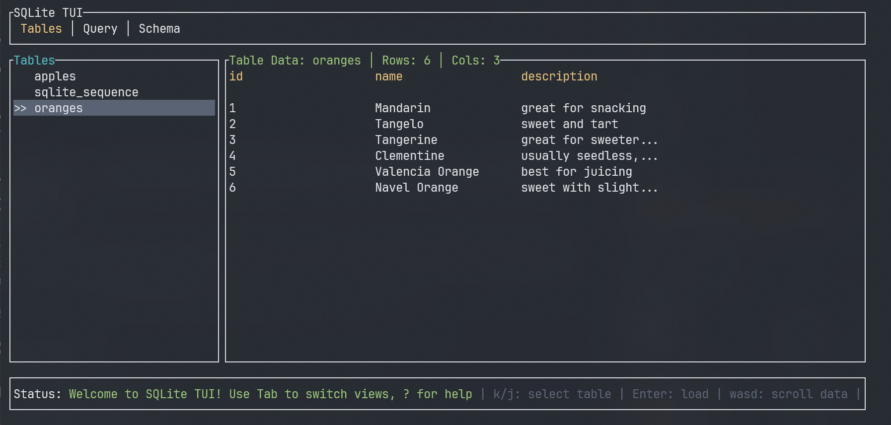
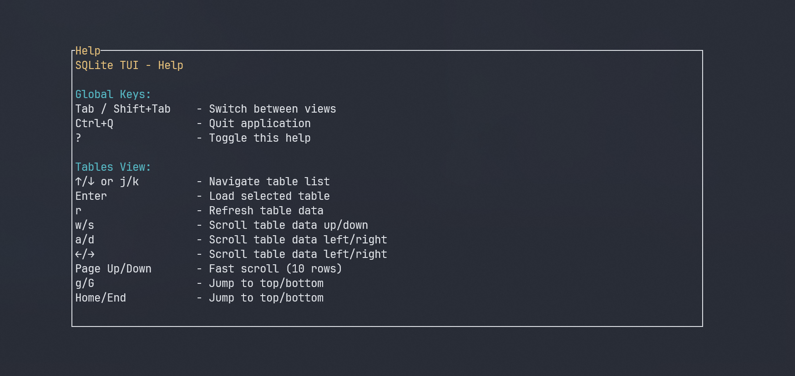
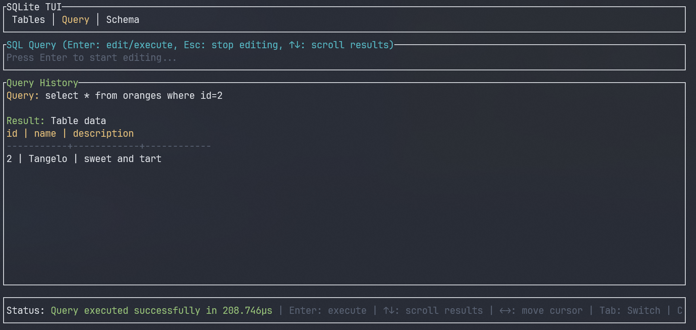
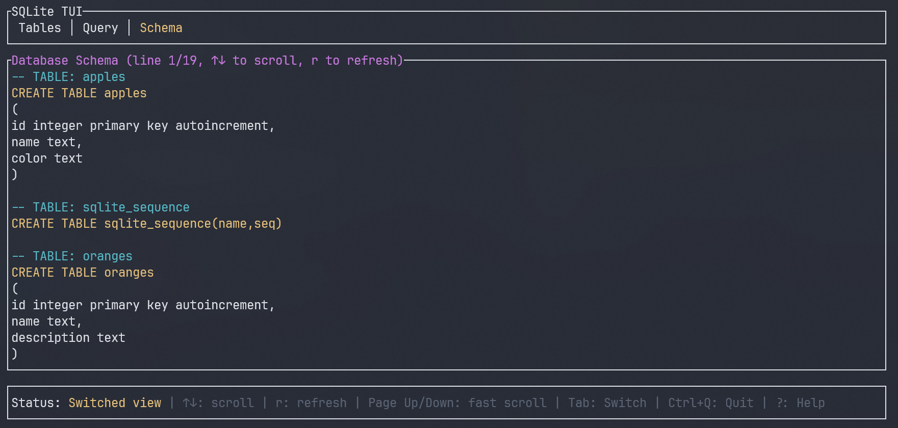

# SQLite Database Engine - High-Performance Rust Implementation

A complete SQLite database engine implementation built from scratch in Rust. Features native B-tree navigation, advanced index optimization, comprehensive WHERE clause parsing, and zero-dependency database file handling. Includes both a high-performance CLI for direct database operations and an optional interactive terminal user interface for visual exploration.


*Interactive TUI showcasing the SQLite engine's capabilities: B-tree navigation, schema analysis, and query execution*

## 🚀 Key Features

### 🔧 **SQLite Database Engine**
- **Native B-tree implementation**: Direct parsing and navigation of SQLite's internal B-tree structure
- **Complete file format support**: Handles SQLite database files without external dependencies
- **Advanced page management**: Efficient reading and caching of database pages
- **Index optimization**: Automatic detection and utilization of database indexes
- **Schema parsing**: Complete parsing of SQLite schema objects and CREATE statements

### 🔍 **SQL Query Engine**
- **Full SQL SELECT support**: Complete WHERE clause parsing with operators (`=`, `!=`, `<`, `>`, `<=`, `>=`)
- **Quote enforcement**: Proper SQL syntax validation requiring quotes for string literals
- **Index-aware execution**: Automatically chooses optimal query execution paths
- **Type system**: Comprehensive handling of SQLite data types (NULL, INTEGER, REAL, TEXT, BLOB)
- **Record parsing**: Direct parsing of SQLite record formats and variable-length integers

### 📊 **Database Navigation & Analysis**
- **B-tree traversal**: Efficient navigation of leaf and interior pages
- **Table exploration**: Direct access to table data without SQL overhead
- **Schema inspection**: Complete database schema with metadata analysis
- **Row counting**: Fast `COUNT(*)` operations using database metadata
- **Cell-level parsing**: Low-level access to SQLite cell structures

### ⚡ **Performance Optimizations**
- **Zero-copy parsing**: Efficient memory usage with minimal data copying
- **Index scanning**: Leverages SQLite indexes for O(log n) filtered queries
- **Lazy loading**: Tables and pages load data only when accessed
- **Memory efficient**: Streaming data processing for large databases
- **Cache optimization**: Intelligent caching of frequently accessed pages

### 🎨 **Terminal User Interface** (Optional)
- **Three-panel design**: Tables browser, SQL query editor, and schema viewer
- **Responsive layout**: Adapts to any terminal size (minimum 80x24)
- **Real-time cursor**: Native cursor blinking and positioning
- **Query history**: Persistent query history with timestamps
- **Help system**: Built-in `?` key help overlay

## 📐 Architecture & Algorithms

### B-Tree Navigation Algorithm

Our implementation efficiently traverses SQLite's B-tree structure:

```
Algorithm: traverse_btree(page_number, target_condition)
Time Complexity: O(log n) for indexed searches, O(n) for table scans
Space Complexity: O(h) where h is tree height

1. Read page header to determine page type
2. If LEAF_PAGE:
   - Linear scan of cells: O(cells_per_page)
   - Apply WHERE conditions: O(1) per cell
3. If INTERIOR_PAGE:
   - Binary search for target range: O(log cells_per_page)
   - Recursively traverse child pages: O(log n)
4. Collect and return matching records
```


### WHERE Clause Engine

Advanced recursive descent engine for SQL WHERE clauses:

```
Grammar:
where_clause := column_name operator value
operator     := '=' | '!=' | '<' | '>' | '<=' | '>='
value        := quoted_string | number

Time Complexity: O(n) where n is clause length
Space Complexity: O(1) for simple conditions
```

**Quote Validation Algorithm:**
```rust
fn validate_value(input: &str) -> Result<String> {
    if input.starts_with('\'') && input.ends_with('\'') {
        return Ok(strip_quotes(input));  // O(1)
    }
    if is_numeric(input) {
        return Ok(input);               // O(1)
    }
    return Err("String values must be quoted");
}
```

### Index Optimization Strategy

```
Algorithm: optimize_query(table, where_clause)
Time Complexity: O(log n) with index, O(n) without index

1. Parse WHERE clause to extract column and value
2. Search for applicable index: O(num_indexes)
3. If index found:
   - Navigate index B-tree: O(log n)
   - Collect matching row IDs: O(k) where k is result count
   - Fetch rows by ID: O(k log n)
4. If no index:
   - Full table scan: O(n)
   - Apply filter conditions: O(n)
```

## ⚡ Performance Analysis

### Time Complexity by Operation

| Operation | Best Case | Average Case | Worst Case | Notes |
|-----------|-----------|--------------|------------|-------|
| Table scan | O(1) | O(n) | O(n) | Linear scan through all rows |
| Indexed WHERE | O(log n) | O(log n + k) | O(n) | k = result count |
| COUNT(*) | O(1) | O(1) | O(1) | Uses SQLite metadata |
| Schema lookup | O(1) | O(1) | O(1) | Cached after first load |
| B-tree navigation | O(log n) | O(log n) | O(log n) | Tree height dependent |
| Query parsing | O(m) | O(m) | O(m) | m = query length |

### Space Complexity

| Component | Memory Usage | Notes |
|-----------|--------------|-------|
| Query history | O(h × q) | h = history size, q = avg query length |
| Table cache | O(r × c) | r = visible rows, c = columns |
| B-tree pages | O(p) | p = pages in memory |
| Index cache | O(i) | i = cached index entries |

## 🛠️ Installation & Setup

### Build from Source

```bash
cargo build --release
```

### Download Sample Databases

```bash
chmod +x download_sample_databases.sh
./download_sample_databases.sh
```

## 📘 Usage Guide

### CLI Mode (Core Engine)

Direct command execution using the SQLite engine:

```bash
./target/release/sqlite-rust sample.db "SELECT * FROM users WHERE age > 25"
./target/release/sqlite-rust sample.db "SELECT COUNT(*) FROM companies"
./target/release/sqlite-rust sample.db ".tables"
./target/release/sqlite-rust sample.db ".schema users"
```

### TUI Mode (Interactive Interface)

Launch the interactive terminal interface for visual database exploration:

```bash
./target/release/sqlite-rust database.db
```

## 🎯 TUI Navigation Reference

### Global Controls

| Keybinding | Action | Context |
|------------|--------|---------|
| `Tab` | Switch to next view | Global |
| `Shift+Tab` | Switch to previous view | Global |
| `Ctrl+Q` | Quit application | Global |
| `?` | Toggle help overlay | Global |
| `Esc` | Exit current mode | Context-sensitive |


*Built-in help system showing all available keybindings*

### Tables View

| Keybinding | Action | Time Complexity |
|------------|--------|-----------------|
| `↑`/`↓`, `j`/`k` | Navigate table list | O(1) |
| `Enter` | Load selected table | O(n) where n = rows |
| `r` | Refresh table data | O(n) |
| `PgUp`/`PgDn` | Scroll data vertically | O(1) |
| `←`/`→`, `h`/`l` | Scroll data horizontally | O(1) |


*Tables view showing navigation and data display*

### Query View

| Keybinding | Action | Notes |
|------------|--------|-------|
| `Enter` | Start/stop editing mode | Toggle input focus |
| `Enter` (while editing) | Execute query | Validates syntax first |
| `Esc` | Exit editing mode | Returns to navigation |
| `←`/`→` | Move cursor | Standard text editing |
| `Backspace` | Delete character | With cursor positioning |
| `↑`/`↓` | Scroll query history | Browse previous queries |

**Query Editor Features:**
- Real-time syntax validation
- Quote enforcement for string literals
- Query history with timestamps
- Error highlighting and detailed messages


*Query editor showing syntax highlighting and validation*

### Schema View

| Keybinding | Action |
|------------|--------|
| `↑`/`↓`, `j`/`k` | Scroll vertically |
| `←`/`→`, `h`/`l` | Scroll horizontally |
| `r` | Refresh schema |
| `PgUp`/`PgDn` | Fast vertical scroll |


*Schema view displaying CREATE statements and table structures*

## 📊 Supported SQL Features

### SELECT Statement Support

- Basic queries: `SELECT * FROM table_name;`
- Column selection: `SELECT column1, column2 FROM table_name;`
- WHERE clauses with full operator support
- Aggregate functions: `SELECT COUNT(*) FROM table_name;`

### Meta Commands

- `.dbinfo` - Database information
- `.tables` - List all tables  
- `.schema` - Show all CREATE statements

## 🏗️ Technical Implementation

### Core Architecture

```
src/
├── main.rs           # Entry point and argument parsing
├── database.rs       # SQLite B-tree operations & file format parsing
├── commands.rs       # SQL parsing and execution engine
├── schema.rs         # Schema parsing and analysis
├── record.rs         # Record value handling & type system
├── cell.rs           # SQLite cell parsing & data extraction
├── varint.rs         # Variable-length integer decoding
└── tui.rs            # Optional TUI implementation (ratatui)
```

### Database Layer

**B-tree Navigation:**
```rust
pub fn collect_all_table_cells(&mut self, page_num: usize) -> Result<Vec<Cell>> {
    let page_data = self.read_page_data(page_num)?;
    let page_type = self.get_page_type(&page_data, page_num);
    
    match page_type {
        LEAF_TABLE_PAGE => self.read_leaf_cells(&page_data, page_num),
        INTERIOR_TABLE_PAGE => {
            let child_pages = self.get_child_page_numbers(&page_data, page_num)?;
            let mut all_cells = Vec::new();
            for child_page in child_pages {
                all_cells.extend(self.collect_all_table_cells(child_page)?);
            }
            Ok(all_cells)
        }
        _ => bail!("Unsupported page type: {}", page_type),
    }
}
```

**Index Optimization:**
```rust
pub fn search_index(&mut self, index: &SchemaObject, value: &str) -> Result<Vec<u64>> {
    let mut row_ids = Vec::new();
    self.traverse_index_for_value(index.rootpage, value, &mut row_ids)?;
    
    // Use collected row IDs for targeted row fetching: O(k log n)
    self.get_table_rows_by_ids(table_name, &row_ids)
}
```

## 🐛 Troubleshooting

### Common Issues

**TUI Display Issues:**
```
Problem: Garbled display or cursor issues
Solution: Ensure terminal supports 256 colors and UTF-8
```


## 📈 Roadmap

### Version 2.0 Features
- [ ] **Advanced SQL**: JOIN support, subqueries, CTEs
- [ ] **Export functionality**: CSV, JSON, SQL dump
- [ ] **Database editing**: INSERT, UPDATE, DELETE operations
- [ ] **Multiple databases**: Tab-based multi-database support
- [ ] **Query optimization**: Visual EXPLAIN QUERY PLAN
- [ ] **Syntax highlighting**: Full SQL syntax highlighting

### Performance Improvements
- [ ] **Parallel processing**: Multi-threaded query execution
- [ ] **Streaming results**: Handle datasets larger than memory
- [ ] **Caching layer**: Intelligent query result caching
- [ ] **Index analysis**: Automatic index recommendations


## 🤝 Contributing

### Development Setup

```bash
git clone https://github.com/your-username/sqlite-rust
cd sqlite-rust
cargo install cargo-watch cargo-audit
cargo watch -x run
```

## 🙏 Acknowledgments

- **ratatui**: Modern terminal UI library for Rust


**Built with ❤️ in Rust** | **Native SQLite engine & B-tree implementation** | **Zero-dependency database engine with optional TUI**

